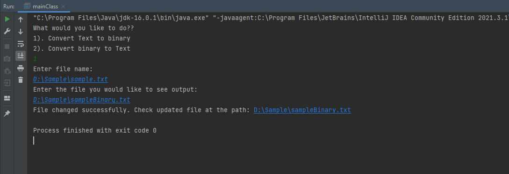

# textToBinary
This program can take text from your .txt files on your computer and converted to binary then put it in a .txt file. 
It can also take your binary .txt file and convert it to text and put it into a .txt file. 

